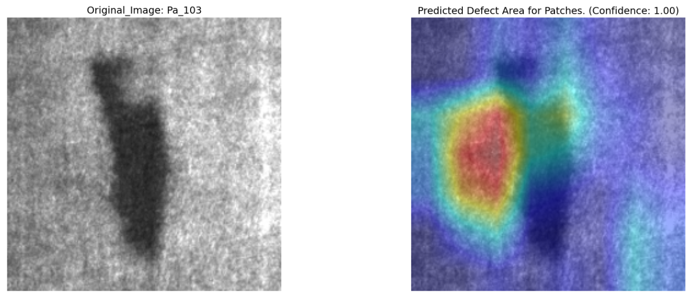
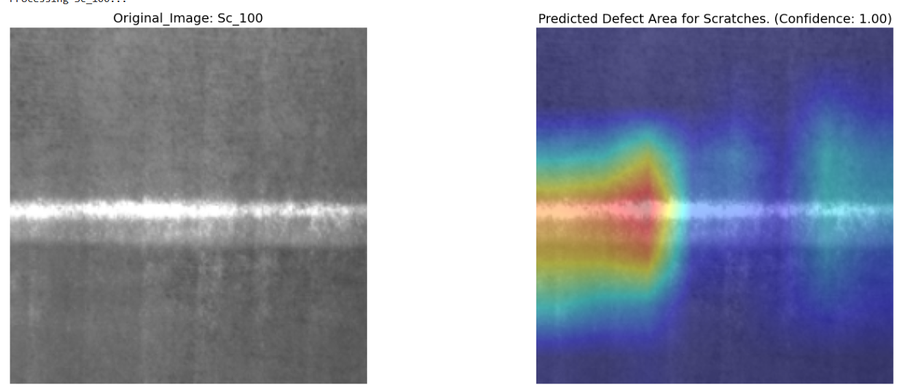

# Metal Surface Defect Detection with GRAD-CAM

  
  
  

## 🔍 Overview
This project implements a deep learning solution for detecting and localizing six types of metal surface defects using Convolutional Neural Networks (CNNs) enhanced with GRAD-CAM visualization. The model provides both classification and visual explanation of defects, making it a powerful tool for industrial quality control.

## 🎯 Features

- **6-Class Defect Detection**: Identifies common metal surface defects:
  - Crazing
  - Inclusion
  - Patches
  - Pitted Surface
  - Rolled-in Scale
  - Scratches

- **Explainable AI**: Generates heatmaps using GRAD-CAM to highlight defective regions
- **High Accuracy**: Deep CNN architecture trained on the NEU Metal Surface Defects Dataset
- **Easy Integration**: Simple API for inference on new images

## 📊 Dataset

The model is trained on the [NEU Metal Surface Defects Dataset](https://www.kaggle.com/datasets/fantacher/neu-metal-surface-defects-data) from Kaggle.

**Dataset Statistics:**
- Total images: 1,800 (300 per class)
- Image size: 200×200 pixels (grayscale)
- Defect types: 6 classes

## 🚀 Getting Started

This project is implemented in Jupyter notebooks. Simply open the following notebooks in your Jupyter environment:

1. `model_training.ipynb` - Contains the model training and evaluation code
2. `defect_visualization.ipynb` - Demonstrates defect detection and GRAD-CAM visualization

## 📋 Requirements

- Jupyter Notebook or JupyterLab
- Python 3.8+
- PyTorch 1.9+
- torchvision
- OpenCV
- NumPy
- Matplotlib
- Grad-CAM

## 📈 Results

### Sample Predictions

  <h3>Patches Defect</h3>
  
  
  <h3>Scratches Defect</h3>
  

## 🏗️ Model Architecture

The model uses a custom CNN architecture with the following components:
- Feature extraction backbone (ResNet50)
- Global Average Pooling
- Fully connected layers for classification
- GRAD-CAM for visualization

## ⚡ Performance Metrics

The model achieves the following performance on the test set:

| Metric      | Score   |
|-------------|---------|
| Loss        | 0.0483  |
| Accuracy    | 98.61%  |
| Precision  | 98.61%  |
| Recall     | 98.61%  |
| F1-Score   | 98.61%  |

These results demonstrate the model's high accuracy in detecting and classifying metal surface defects.

## 📋 Requirements

- Python 3.8+
- PyTorch 1.9+
- torchvision
- OpenCV
- NumPy
- Matplotlib
- Grad-CAM
- Gradio (for web demo)

## 📜 License

This project is licensed under the MIT License - see the [LICENSE](LICENSE) file for details.

## 🙏 Acknowledgments

- [NEU Metal Surface Defects Dataset](https://www.kaggle.com/datasets/fantacher/neu-metal-surface-defects-data)
- [Grad-CAM: Visual Explanations from Deep Networks](https://arxiv.org/abs/1610.02391)
- PyTorch and OpenCV communities

## 🤝 Contributing

Contributions are welcome! Please feel free to submit a Pull Request.

---

  Made with ❤️ for better industrial quality control

